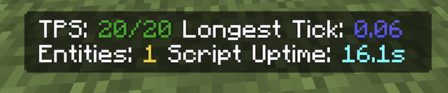

# Minecraft Debug Tools

Tools to make Minecraft debugging easier. Made to help add-on, map, and other Minecraft creators.

## Features

- Script and function reload indication
- TPS counter
- Tracks longest tick during a lag spike
- Entity counter
- Tracks script and function pack uptime
- Quick gamemode change commands: .gms, .gmc, etc
- Toggles for all features
- Configurable settings

## Installation

1. Download the mcpack from the latest [release](https://github.com/gassayping/mc-debug-tools/releases/) or from [MCPEDL](https://mcpedl.com/debug-tools/)
2. Open the file in Minecraft
3. Make sure to enable the "Beta APIs" experimental toggle when adding the pack to a world
