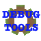

# Minecraft Debug Tools

Tools to make Minecraft debugging easier. Made to help add-on, map, and other Minecraft creators.

## Features

- Script and function reload indication
- TPS counter
- Tracks longest tick during a lag spike
- Entity counter
- Tracks script and function pack uptime
- Quick gamemode change commands: .gms, .gmc, etc
- Toggles for all features
- Configurable settings
